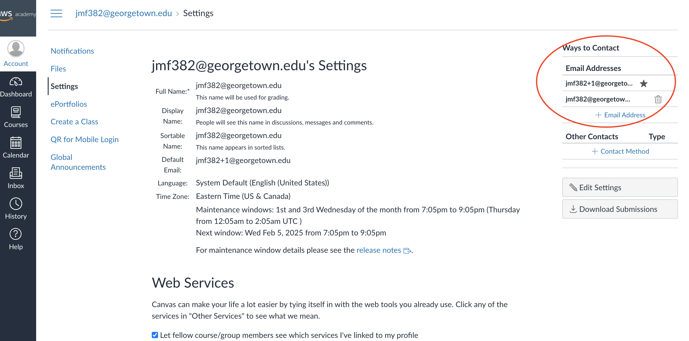

# AWS Account Setup Guide

This document outlines the steps for requesting and setting up new AWS Learner Lab accounts, including account provisioning, student login and cross-account access.

## Account Setup Steps

| Step # | Step Description                                      | Who            | What                                             |
|--------|------------------------------------------------------|---------------|------------------------------------------------|
| 1      | Request a new AWS Learner Lab account                | Student       | Submit a request in the #aws channel on Slack |
| 2      | Create the account with `email+n`                   | TA/Professor   | Add the account using AWS Learner Lab console        |
| 3      | Confirm new account invite with students            | TA/Professor   | Reply to the request thread on Slack     |
| 4      | Students log in and set up their accounts           | Student        | Follow the pinned login instructions (below)  |
| 5      | Add student account details to the Google Sheet     | Student        | Update the tracking sheet with new aws account info   |
| 6      | Enable aws cross-account access                     | Professor/TA      | Grant necessary permissions                   |

## Login Instructions

If you received a new AWS account and need instructions to access your new lab learner, please follow these steps:

1. **AWS Course Invite**:  
   Professor Amit or a TA will send you a new AWS course invite which will grant access to a new learner lab account associated with your Georgetown email and a `+n` (e.g., `johndoe124+1@georgetown.edu`).

2. **Accept the Invite**:  
   Click on the invite link. This should take you to the **AWS Academy login page**.

3. **Log in Using Your Old Account**:  
   **DO NOT use the new email (`+n` email) to log in.** Instead, log in using your ORIGINAL Georgetown email (without the `+n`).

4. **Update Your Contact Email**:  
   - Once inside your old account, navigate to **Account** > **Settings**.  
   - On the upper-right side, find the **"Ways of Contact"** section.  
   - Click on the ⭐ star next to your `+n` email to set it as the primary email.

   

5. **Access Your Learner Lab**:  
   You should now be able to launch your new AWS Learner Lab.

6. **Update Your Account ID**:  
   After setting up your account, update your **AWS Account ID** in the tracking spreadsheet:  
   [Google Sheet Link](https://docs.google.com/spreadsheets/d/1Qo5jXVZpmoMk_JnSCMNmdoNLTAj1Al8KVZBc69iiAvc/edit?gid=0#gid=0)

### Note on `+n` Email Notation
The `+n` in your email (e.g., `johndoe124+1@georgetown.edu`) represents the number of AWS accounts you have requested. The first request will have `+1`, the second will have `+2`, and so on. This helps differentiate multiple accounts associated with the same email.
